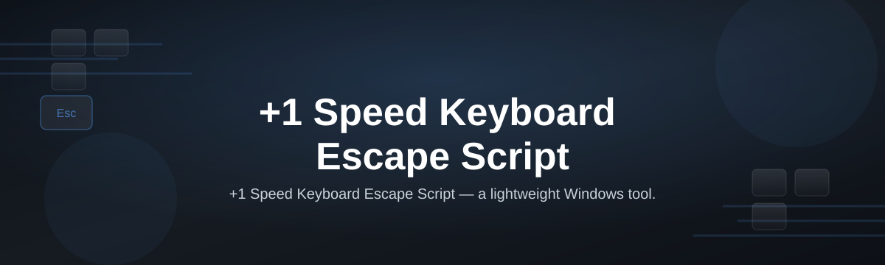
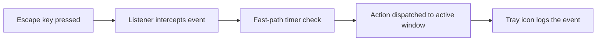

# keyboard-escape-script-hub

*A small, focused script for anyone who wants their Escape key to actually do something useful — instantly.*

## What this is

This is not a macro suite, not a game overlay, and not a background service that phones home. There's no account, no subscription, no bundled toolbar. The `keyboard-escape-script-hub` is a single standalone Windows utility built around one idea: the +1 Speed Keyboard Escape Script — a lightweight remap that turns your Escape key into a fast, single-press "get out of this state" action, running at a slightly accelerated response rate compared to the default OS key handling.

If you've ever needed Escape to reliably close a fullscreen window, drop out of a stuck input field, or cancel an action a beat faster than Windows normally registers it, that's the exact gap this fills. It doesn't touch your registry, doesn't require driver-level hooks, and doesn't rewrite your whole keyboard layout — it does one thing, and it does it at the speed the name promises.

  

The button above opens the project's landing page, where you can download the current build directly.

## Who it is for

- **Fast typists** who lose fractions of a second to sluggish Escape response in dense editors or terminals.
- **Streamers and recorders** who need a snappy, consistent "cancel/exit" key during live capture.
- **Accessibility-minded users** who want a single predictable key that always behaves the same way, faster.
- **Kiosk and shared-PC maintainers** who need a quick, no-install escape hatch from locked-down apps.
- **Script tinkerers** who want a small, readable base script to study or extend rather than a black box.

## What you can do

- **Remap Escape to a +1 speed response** without editing Windows registry keys.
- **Run it portably** from a USB stick or any folder — no installer, no admin prompt required for basic use.
- **Toggle it on/off** with a tray icon click, no need to close and relaunch.
- **Layer it with existing shortcuts** since it only intercepts Escape, leaving other keys untouched.
- **Adjust the response window** via a simple config value if the default feels too aggressive or too soft.
- **Log activations** to a local text file for your own debugging, nothing sent externally.
- **Exit cleanly** at any time from the tray menu, restoring default Escape behavior instantly.
- **Reuse the script logic** as a starting point for your own single-key remaps.

## Getting started

1. Open the landing page using the download button above.
2. Download the latest release archive for Windows.
3. Extract it to any folder — Desktop, USB drive, or a tools folder both work fine.
4. Double-click the executable to launch; a tray icon confirms it's running.
5. Press Escape once to confirm the faster response, then leave it running in the background.

## Requirements

- Windows 10 or Windows 11 (64-bit).
- No installation, no toolchain, no build step — it runs as a standalone executable.
- No admin rights needed for normal use; some corporate lockdown policies may require an exception.
- Roughly 5 MB of disk space and no persistent internet connection after download.

## How it works

The script sits quietly as a low-level keyboard listener, watches specifically for the Escape key, and reacts before the default OS debounce delay would normally fire. It doesn't remap Escape to a different key — it shortens the round trip between the physical press and the action Windows executes.

1. The listener registers a system-wide hook scoped only to Escape.
2. On press, it checks a short internal timer instead of waiting on the default OS cycle.
3. If the timer passes, the key event is dispatched immediately to the focused window.
4. The tray process optionally writes a local log entry.
5. Releasing Escape resets the timer for the next press.

## FAQ

**Does the +1 Speed Keyboard Escape Script change my keyboard layout?**
No. It only adjusts how quickly the Escape key event is passed through — nothing else on your keyboard is affected.

**Will this conflict with games that already hook Escape?**
Most games handle Escape internally, so behavior can vary. If a game's own menu stops responding correctly, close the script and test again before reporting an issue.

**Can I run this on Windows 7 or 8?**
It's built and tested for Windows 10/11 only. Older versions aren't supported and may behave unpredictably.

**Does it need to run as administrator?**
No, for standard use. Only some restricted enterprise environments enforce policies that require elevation for any keyboard hook.

**Is there a portable version I can carry on a USB stick?**
Yes — the executable itself is portable; no installer writes anything outside its own folder.

## Troubleshooting

- **Tray icon appears but Escape feels unchanged:** confirm no other keyboard utility (like a third-party remapper) is also hooking Escape at the same time.
- **Script won't launch on double-click:** check that Windows SmartScreen didn't quarantine the file; allow it through if you trust the source.
- **Escape stops responding in one specific app:** that app likely has its own low-level hook; close the script temporarily to confirm, then decide whether to run both together.
- **Settings don't persist after restart:** make sure the folder isn't read-only and the config file sits next to the executable, not in a moved copy.

## License

Released under the [MIT License](LICENSE). This is an independent hobby project provided as-is, with no warranty; use it at your own discretion, especially in managed or corporate environments.

  

